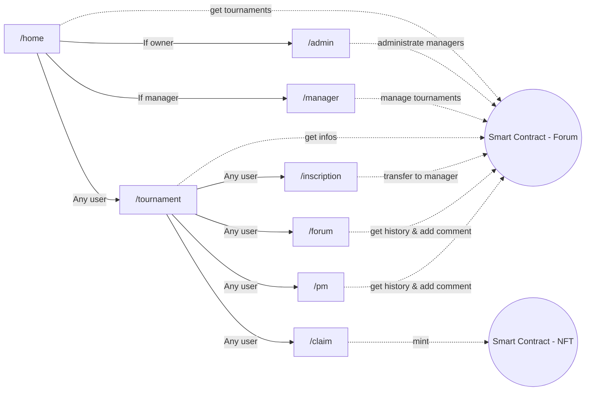

# PadelConnect

PadelConnect est une application décentralisée de gestion de tournois de Padel permettant de créer une communauté autour de ce sport en proposant notamment un réseau social décentralisé.  

## Description

### Rôles
| Rôle | Description |
|----|----|
| Owner | Le propriétaire est l'administrateur de l'application. |
| Manager | Un <i>manager</i> est celui qui gère ses tournois. |
| Player | Toute personne n'étant pas <i>manager</i> ni <i>owner</i> est un jouer. |

### Liens

- [ ] Site web déployé : 
- [ ] url 2 contracts
- [ ] Board of issues

### Stack technique

- [ ] Lister sous forme de badges les technos utilisées

## Schéma d'architecture technique
Le schéma ci-dessous montrent les interactions entre le frontend et les smart contracts :  

## Description des fonctionnalités

- [ ] Résumé des éléments fonctionnels du projet.

## Instructions d'installation

- [ ] Liste des commandes pour lancer le projet : Backend
- [ ] Liste des commandes pour lancer le projet : Frontend
- [ ] Commande pour lancer les TU + rapport à ajouter
- [ ] Scripts de migration
- [ ] Scripts personnels : ajout d'un manager et d'un tournoi / ajout de messages ...

### Backend
### Frontend
### Tests unitaires
