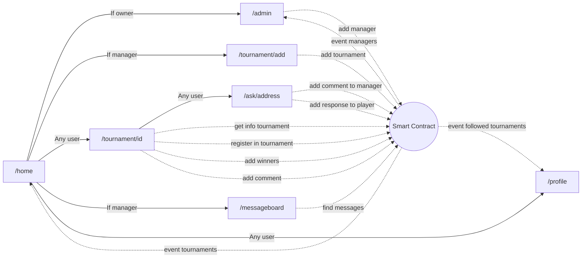

# PadelConnect

  
PadelConnect est une application décentralisée de gestion de tournois de Padel permettant de créer une communauté autour de ce sport en proposant notamment un réseau social décentralisé.  

## Description

### Liens

- Maquettes réalisées sur [Balsamiq.cloud](https://balsamiq.cloud/somhp53/p5sdeh6)
- Url de la dApp déployée : https://padel-connect.vercel.app/
- Adresse du contrat sur Sepolia : [0x5b3e6a0027439Ab1F439A41B22DF2AB26Bc82719](https://sepolia.etherscan.io/address/0x5b3e6a0027439Ab1F439A41B22DF2AB26Bc82719)
- Tableau de bord des issues : https://github.com/mickablondo/PadelConnect/issues?q=is%3Aissue
- [ ] Lien vidéo démo

### Stack technique

- [ ] Lister sous forme de badges les technos utilisées : React / Nextjs / Wagmi / Viem /Solidity / Git / Chakra-ui / Rainbow Kit / EtherJs / Hardhat / chaijd

### Rôles
| Rôle | Description |
|----|----|
| Owner | Le propriétaire est l'administrateur de l'application. |
| Manager | Un <i>manager</i> est celui qui gère ses tournois. |
| Player | Toute personne n'étant pas <i>manager</i> ni <i>owner</i> est un jouer. |  

### Fonctionnalités
  

## Schéma des interactions
Le schéma ci-dessous montrent les interactions entre le frontend et les smart contracts :  



## Instructions d'installation

### Backend
Se baser sur le fichier <i>.env.example</i> pour configurer la partie backend.  
  
Pour ajouter les dépendances :  
```sh
npm install
```

Pour déployer le smart contract en local :  
```sh
npx hardhat node  
npx hardhat run scripts/deploy.js --network localhost
```  
  
Pour déployer sur un testnet comme Sepolia :  
```sh
npx hardhat run scripts/deploy.js --network sepolia
```

### Frontend
Se baser sur le fichier <i>.env.example</i> pour configurer la partie frontend.  
  
Pour ajouter les dépendances :  
```sh
npm install
```  
  
Pour démarrer la partie frontend en local :  
```sh
npx next dev
```  

### Jeux de données 
3 scripts ont été créés dans scripts/datas permettant l'insertion de jeux de données :  
 - add_datas.js : ajoute un manager, plusieurs tournois et un commentaire ;
 - add_messages_to_manager.js : crée 3 messages entre un joueur et un manager (pré-requis : add_datas.js);
 - add_newtournament.js : ajoute un nouveau tournoi (pré-requis : add_datas.js);
 - register_player.js : enregistre 2 joueurs sur un tournoi et crée 2 commentaires sur ce même tournoi (pré-requis : add_datas.js / <b>Attention</b>, vous n'avez que 30s pour exécuter ce script après le pré-requis !);
  
Pour les exécuter :  
```bash
npx hardhat run scripts/datas/add_datas.js --network localhost
npx hardhat run scripts/datas/add_messages_to_manager.js --network localhost
npx hardhat run scripts/datas/add_newtournament.js --network localhost
npx hardhat run scripts/datas/register_player.js --network localhost
```

### Tests unitaires
Exécuter un noeud Hardhat : 
```bash
npx hardhat node
```
Puis il faut soit exécuter les tests seuls soit les tests avec la couverture :  
```bash
npx hardhat test  
npx hardhat coverage
```

Résultat :  
```bash
  Test PadelConnect
    Initialization
      ✔ should deploy the smart contract
    Adding managers
      ✔ should add a new manager
      ✔ should revert when caller is not the owner
      ✔ should revert when the manager address is the zero address
      ✔ should revert when the address was ever registered
    Adding tournaments
      ✔ should add a new tournament
      ✔ should emit an event when adding a new tournament
      ✔ should revert when caller is not a manager
      ✔ should revert when the city is empty
      ✔ should revert when the date is in the past
      ✔ should revert when the number of players is odd
      ✔ should return the informations of a tournament with a difficulty p500
      ✔ should return the difficulty p25
      ✔ should return the difficulty p100
      ✔ should return the difficulty p250
      ✔ should return the difficulty p1000
      ✔ should return the difficulty p2000
      ✔ should revert if the difficulty is unknown
    After registrering players
      Followers
        ✔ should adding a follower to a tournament
        ✔ should emit an event when adding a follower to a tournament
        ✔ should deleting a follower to a tournament
        ✔ should revert if id does not exist
      Adding winners
        ✔ should add the winners
        ✔ should revert when caller is not the good manager
        ✔ should revert if the two winners are the same person
        ✔ should revert if id does not exist
        ✔ should revert if winner1 is the 0 address
        ✔ should revert if winner2 is the 0 address
        ✔ should revert if a winner has been not registered
      Forum
        ✔ should add a new commment
        ✔ should revert if id does not exist
        ✔ should revert when player send many messages in a short time
        ✔ should revert if message is empty
      Messages from a player to a manager
        ✔ should add a new message to a manager
        ✔ should not modify the exchanges array when adding two new messages to a manager (3024ms)
        ✔ should revert if id does not exist
        ✔ should revert when player send many messages in a short time
        ✔ should revert if message is empty
      Response to the messages by the manager
        ✔ should add a new response
        ✔ should revert when caller is not a manager
        ✔ should revert if id does not exist
        ✔ should revert when player send many messages in a short time
        ✔ should revert if message is empty
        ✔ should revert when player address is the zero address
        ✔ should revert if id does not exist when getting messages
        ✔ should revert when player address is the zero address when getting messages
    Registering players
      ✔ should decrease the number of registrations allowed when adding a new player
      ✔ should add a new tournament for the player registered
      ✔ should revert if the id does not exist
      ✔ should revert when the player is already registered
      ✔ should revert when the tournament is complete
      ✔ should revert when tournament is already started


  52 passing (5s)

--------------------|----------|----------|----------|----------|----------------|
File                |  % Stmts | % Branch |  % Funcs |  % Lines |Uncovered Lines |
--------------------|----------|----------|----------|----------|----------------|
 contracts/         |      100 |      100 |      100 |      100 |                |
  IPadelConnect.sol |      100 |      100 |      100 |      100 |                |
  PadelConnect.sol  |      100 |      100 |      100 |      100 |                |
--------------------|----------|----------|----------|----------|----------------|
All files           |      100 |      100 |      100 |      100 |                |
--------------------|----------|----------|----------|----------|----------------|
```

En version web via le fichier <i>./coverage/contracts/index.html</i> :  
  


  
> **Note**  
> Ajout de la librairie <i>@nomicfoundation/hardhat-network-helpers</i> pour manipuler la date de la blockchain.


```js
it('should revert when tournament is already started', async function() {
    await time.increaseTo(2087697299);
    await expectRevert(
        pcContract.connect(player1).registerPlayer(0, 'roger', 'federer'),
        "RegistrationEnded"
    );
});
```

> **Note**  
> Ajout de la librairie <i>timers/promises</i> pour forcer un temps d'attente entre 2 messages envoyés.

```sh
✔ should not modify the exchanges array when adding two new messages to a manager (3025ms)
```
